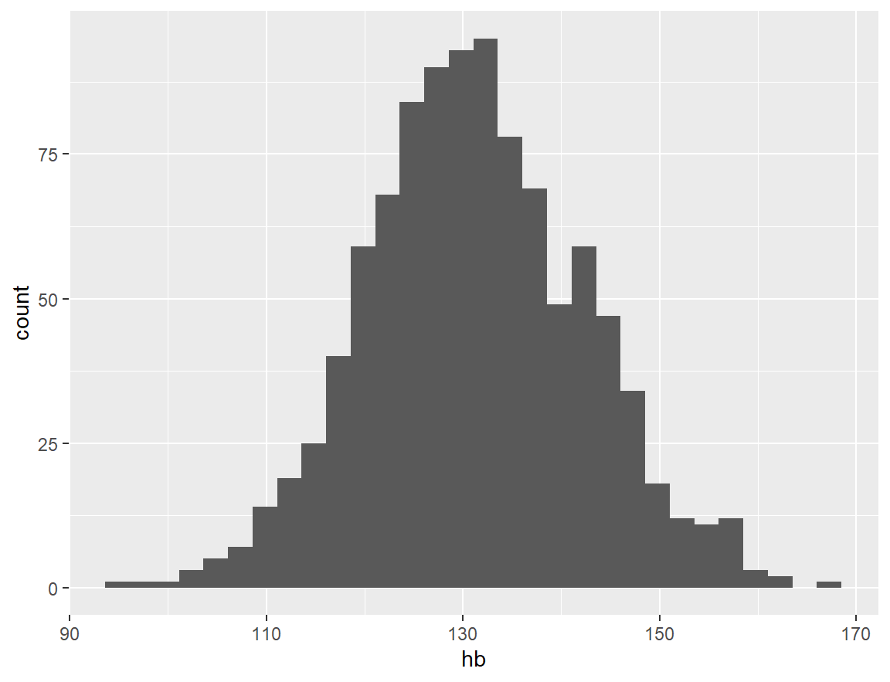
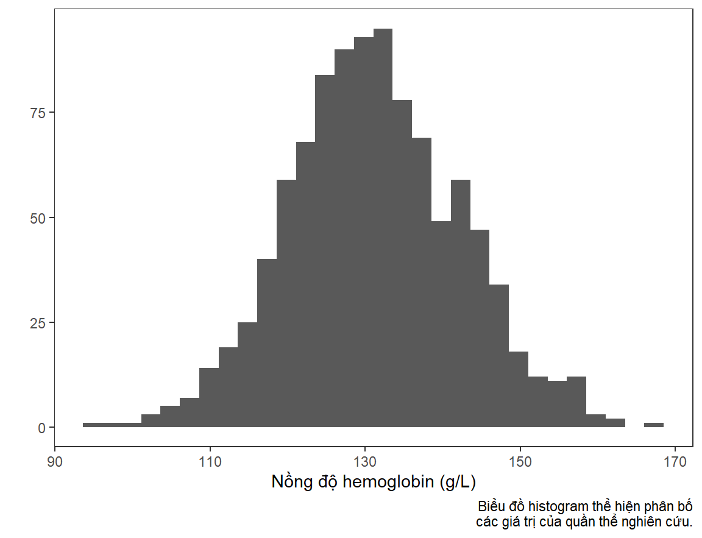
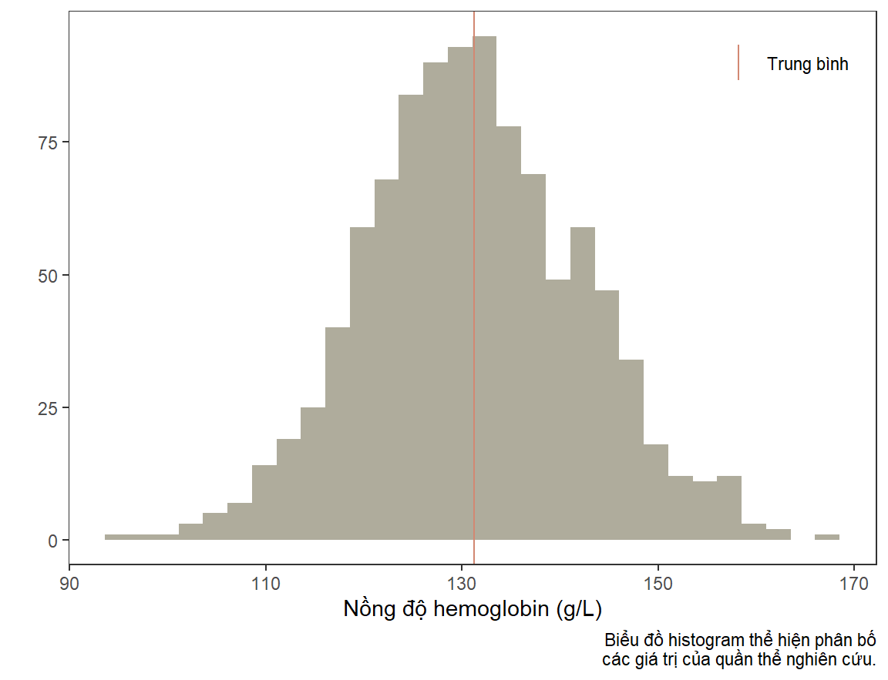
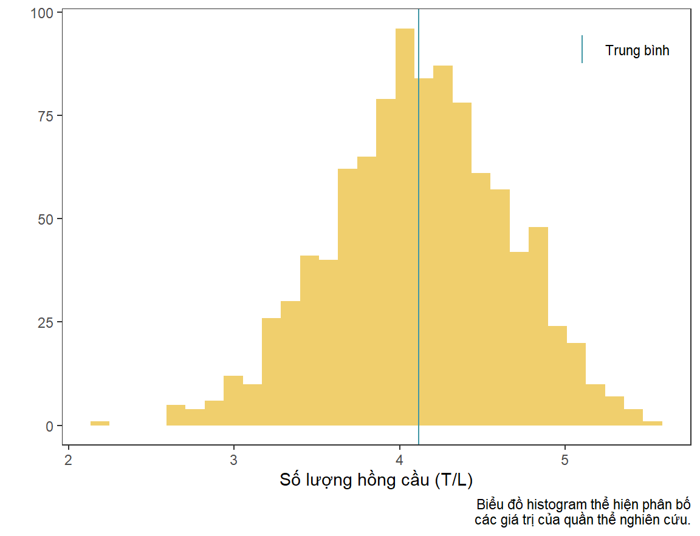
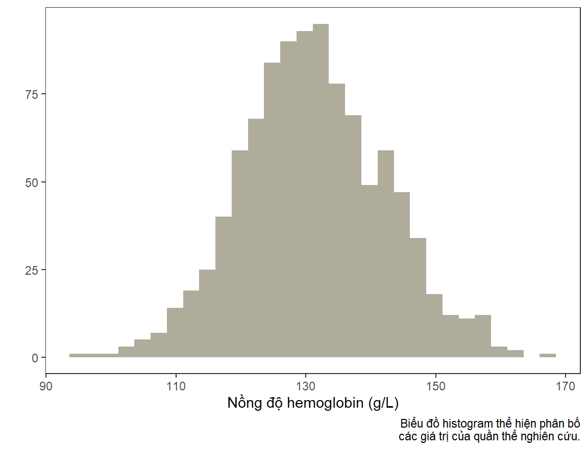
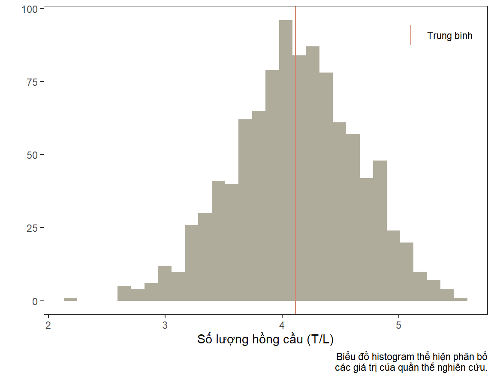
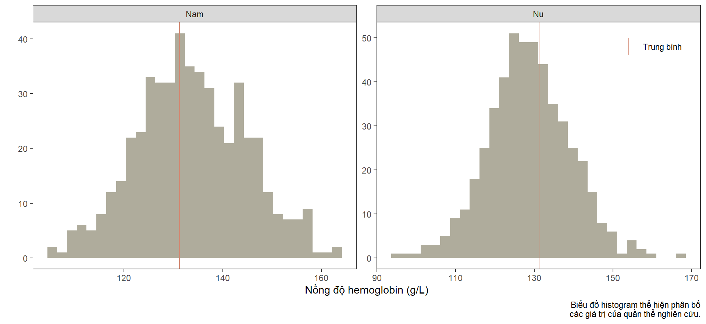
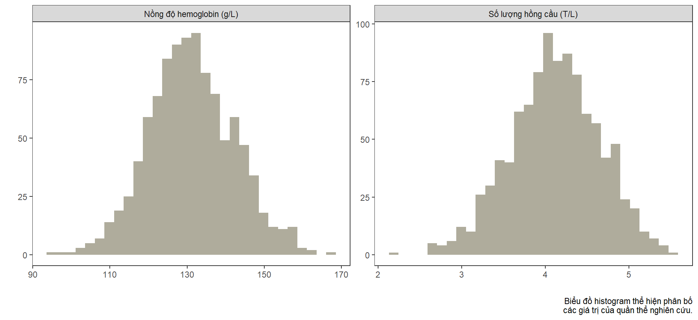
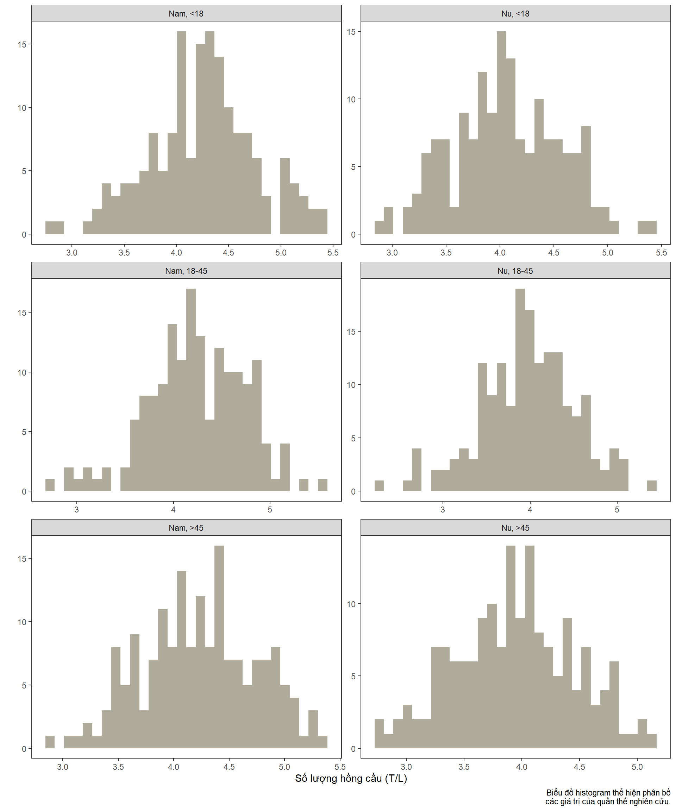

::: {.cell}

```{.r .cell-code}
library(knitr)
opts_chunk$set(
    message = FALSE,
    warning = FALSE
)
```
:::


# Bài toán

Hôm nay chúng ta sẽ nói về việc sử dụng hàm trong R. Chúng ta sẽ cùng tìm hiểu khi nào nên sử dụng hàm và vai trò của nó trong việc tối ưu hóa việc lập trình.

Chúng ta sẽ có một cơ sở dữ liệu gồm các biến `gioi` (Nam/Nữ), `do_tuoi` (ba nhóm độ tuổi), `hb` (nồng độ hemoglobin), và `rbc` (số lượng hồng cầu).


::: {.cell}

```{.r .cell-code}
library(dplyr)
library(tidyr)

set.seed(0)
n <- 1000

d <- data.frame(
    stt = seq(n),
    gioi = factor(sample(c(1, 2), n, TRUE),
        levels = c(1, 2), labels = c("Nam", "Nu")),
    do_tuoi = factor(sample(c(1, 2, 3), n, TRUE),
        levels = c(1, 2, 3), labels = c("<18", "18-45", ">45"))
) %>%
    mutate(
        hb = round(rnorm(n, 130, 10) + 5 * (gioi == "Nam") - 3.5 * (do_tuoi == ">45"), 1),
        rbc = round(rnorm(n, 4, 0.5) + 0.25 * (gioi == "Nam") - 0.1 * (do_tuoi == ">45"), 2)
    )

d %>% head(10) %>% kable()
```

::: {.cell-output-display}
| stt|gioi |do_tuoi |    hb|  rbc|
|---:|:----|:-------|-----:|----:|
|   1|Nu   |>45     | 122.1| 3.93|
|   2|Nam  |>45     | 127.7| 4.95|
|   3|Nu   |>45     | 121.5| 3.89|
|   4|Nam  |<18     | 140.0| 3.98|
|   5|Nam  |>45     | 146.7| 5.14|
|   6|Nu   |<18     | 139.9| 3.32|
|   7|Nam  |18-45   | 147.5| 4.46|
|   8|Nam  |<18     | 131.7| 3.76|
|   9|Nam  |18-45   | 143.4| 4.85|
|  10|Nu   |18-45   | 120.2| 4.22|
:::
:::


Chúng ta sẽ vẽ biểu đồ histogram cho các biến `hb` và `rbc`.


# Vẽ biểu đồ bằng `ggplot2`

Thư viện `ggplot2` cung cấp cho chúng ta một engine đồ họa mạnh với khả năng tùy biến cao. Hãy cùng nhau vẽ một biểu đồ histogram cho biến `hb` và sau đó tùy biến nó. Đầu tiên, chúng ta sẽ dùng tối thiểu số lệnh cần để vẽ biểu đồ này. Lưu ý: trong bài này mình không giới thiệu tính năng các hàm trong `ggplot2`, bạn sẽ phải tự tìm hiểu ở những khóa học khác.


::: {.cell}

```{.r .cell-code}
library(ggplot2)

ggplot(d, aes(x = hb)) +
    geom_histogram()
```

::: {.cell-output-display}
{width=576}
:::
:::


Có một số tùy biến mà chúng ta thường sẽ muốn thiết lập để biểu đồ nhìn có thẩm mỹ hơn. Chẳng hạn, mình muốn chuyển sang theme đen-trắng, loại bỏ các đường dóng, đổi tên trục biểu đồ, và thêm ghi chú.


::: {.cell}

```{.r .cell-code}
ggplot(d, aes(x = hb)) +
    geom_histogram() +
    theme_bw() +
    theme(panel.grid = element_blank()) +
    labs(
        x = "Nồng độ hemoglobin (g/L)",
        y = "",
        caption = "Biểu đồ histogram thể hiện phân bố\ncác giá trị của quần thể nghiên cứu."
    )
```

::: {.cell-output-display}
{width=576}
:::
:::


Mình chợt nhận ra là mình muốn thêm đường thẳng thể hiện trung bình của nồng độ hemoglobin vào biểu đồ này, và thay đổi màu sắc của histogram.


::: {.cell}

```{.r .cell-code}
ggplot(d, aes(x = hb)) +
    geom_histogram(fill = "#afac9c") +
    geom_vline(
        aes(
            xintercept = d %>% pull(hb) %>% mean(na.rm = TRUE),
            color = "mean"
        )
    ) +
    theme_bw() +
    theme(
        panel.grid = element_blank(),
        legend.position = c(0.98, 0.98),
        legend.justification = c("right", "top"),
        legend.title = element_blank()
    ) +
    labs(
        x = "Nồng độ hemoglobin (g/L)",
        y = "",
        caption = "Biểu đồ histogram thể hiện phân bố\ncác giá trị của quần thể nghiên cứu."
    ) +
    scale_color_manual(
        values = c(mean = "#d28872"),
        labels = c(mean = "Trung bình")
    )
```

::: {.cell-output-display}
{width=576}
:::
:::


Bây giờ chúng ta sẽ vẽ tương tự cho biến `rbc`. Bạn nhận ra rằng mình sẽ sao chép lại một đoạn mã lệnh rất dài. Và giả sử mình muốn sử dụng những màu sắc khác cho histogram và đường trung bình, mình sẽ phải chỉnh sửa lại các dòng lệnh liên quan.


::: {.cell}

```{.r .cell-code}
ggplot(d, aes(x = rbc)) +
    geom_histogram(fill = "#f0cf6d") +
    geom_vline(
        aes(
            xintercept = d %>% pull(rbc) %>% mean(na.rm = TRUE),
            color = "mean"
        )
    ) +
    theme_bw() +
    theme(
        panel.grid = element_blank(),
        legend.position = c(0.98, 0.98),
        legend.justification = c("right", "top"),
        legend.title = element_blank()
    ) +
    labs(
        x = "Số lượng hồng cầu (T/L)",
        y = "",
        caption = "Biểu đồ histogram thể hiện phân bố\ncác giá trị của quần thể nghiên cứu."
    ) +
    scale_color_manual(
        values = c(mean = "#4197a5"),
        labels = c(mean = "Trung bình")
    )
```

::: {.cell-output-display}
{width=576}
:::
:::


# Đóng gói công việc bằng hàm

Chúng ta đã thực hiện các công việc sau đây:

* Khởi tạo một biểu đồ
* Vẽ histogram
* Vẽ đường thẳng trung bình
* Định dạng lại biểu đồ

Bạn có thể thấy rằng tất cả các dòng lệnh cho công việc này nối với nhau bằng toán tử `+`:

```
<công_việc_1> +
    <công_việc_2> +
    <công_việc_3> +
    ...
```

Hãy cùng nhau gói các công việc này vào trong hàm. Để thuận tiện, mình sẽ gói công việc khởi tạo biểu đồ và định dạng chung vào một hàm.


::: {.cell}

```{.r .cell-code}
library(rlang)

# Công việc 1: Khởi tạo biểu đồ
plot_create <- function(data) {
    ggplot(data) +
        theme_bw() +
        theme(
            panel.grid = element_blank()
        )
}

# Công việc 2: Vẽ histogram
plot_histogram <- function(g, var_name, var_label, bar_fill) {
    g +
        geom_histogram(
            aes(x = !!sym(var_name)),
            fill = bar_fill
        ) +
        labs(
            x = var_label,
            y = "",
            caption = "Biểu đồ histogram thể hiện phân bố\ncác giá trị của quần thể nghiên cứu."
        )
}

# Công việc 3: Vẽ đường thẳng trung bình
plot_mean <- function(g, data, var_name, line_color) {
    g +
        geom_vline(
            aes(
                xintercept = data %>% pull(!!sym(var_name)) %>% mean(na.rm = TRUE),
                # Có cách làm khác sử dụng stat_summary(),
                # bạn tự tìm hiểu nhé.
                color = "mean"
            )
        ) +
        scale_color_manual(
            values = c(mean = line_color),
            labels = c(mean = "Trung bình")
        ) +
        theme(
            legend.position = c(0.98, 0.98),
            legend.justification = c("right", "top"),
            legend.title = element_blank()
        )
}
```
:::


Sau khi đã xây dựng xong các hàm này, chúng ta có thể vẽ như ý muốn. Với biểu đồ cho hemoglobin, mình không muốn vẽ đường thẳng trung bình.


::: {.cell}

```{.r .cell-code}
var_name <- "hb"
var_label <- "Nồng độ hemoglobin (g/L)"
bar_fill <- "#afac9c"

plot_create(d) %>%
    plot_histogram(var_name, var_label, bar_fill)
```

::: {.cell-output-display}
{width=576}
:::
:::


Nhưng với biểu đồ cho hồng cầu, mình sẽ vẽ đường thẳng trung bình, và giữ nguyên thiết lập màu sắc của biểu đồ trước.


::: {.cell}

```{.r .cell-code}
var_name <- "rbc"
var_label <- "Số lượng hồng cầu (T/L)"
line_color <- "#d28872"

plot_create(d) %>%
    plot_histogram(var_name, var_label, bar_fill) %>%
    plot_mean(d, var_name, line_color)
```

::: {.cell-output-display}
{width=576}
:::
:::


## Vẽ nhiều biểu đồ cho dưới nhóm

Giả sử bạn muốn vẽ hai biểu đồ histogram của `hb` cho hai nhóm giới tính. Chúng ta dễ dàng được điều này với hàm `facet_wrap()`.


::: {.cell}

```{.r .cell-code}
plot_subgroup <- function(g, var_subgroup, ncol = 2) {
    g +
        facet_wrap(vars(!!sym(var_subgroup)), ncol = ncol, scales = "free")
}

var_name <- "hb"
var_label <- "Nồng độ hemoglobin (g/L)"
bar_fill <- "#afac9c"
line_color <- "#d28872"
var_subgroup <- "gioi"

plot_create(d) %>%
    plot_histogram(var_name, var_label, bar_fill) %>%
    plot_mean(d, var_name, line_color) %>%
    plot_subgroup(var_subgroup)
```

::: {.cell-output-display}
{width=960}
:::
:::


## Vẽ nhiều biểu đồ cho nhiều biến

Bạn sẽ tự hỏi liệu có thể làm tương tự nhưng vẽ hai biểu đồ cho hai biến `hb` và `rbc` được không? Câu trả lời là chúng ta sẽ cần chuẩn bị dữ liệu cho việc này bằng `tidyr::pivot_longer()`.


::: {.cell}

```{.r .cell-code}
prepare_long_data <- function(data, vars_to_long, vars_labels,
    names_to = "variable", values_to = "value") {
    data %>%
        pivot_longer(
            any_of(vars_to_long),
            names_to = names_to, values_to = values_to
        ) %>%
        mutate(
            !!names_to := factor(!!sym(names_to),
                levels = vars_to_long, labels = vars_labels)
        )
}

prepare_long_data(d, c("hb", "rbc"), c("Hb", "RBC")) %>% head() %>% kable()
```

::: {.cell-output-display}
| stt|gioi |do_tuoi |variable |  value|
|---:|:----|:-------|:--------|------:|
|   1|Nu   |>45     |Hb       | 122.10|
|   1|Nu   |>45     |RBC      |   3.93|
|   2|Nam  |>45     |Hb       | 127.70|
|   2|Nam  |>45     |RBC      |   4.95|
|   3|Nu   |>45     |Hb       | 121.50|
|   3|Nu   |>45     |RBC      |   3.89|
:::
:::


Với dữ liệu dạng dọc như thế này, chúng ta có thể sử dụng các hàm nêu trên, nhưng đổi tên các biến. Mình bỏ hàm vẽ đường thẳng trung bình vì trong trường hợp này bạn sẽ cần viết lại hàm (sử dụng hàm `ggplot2::stat_summary()`).


::: {.cell}

```{.r .cell-code}
vars_to_long <- c("hb", "rbc")
vars_labels <- c(
    "Nồng độ hemoglobin (g/L)",
    "Số lượng hồng cầu (T/L)"
)
var_name <- "value"
var_label <- ""
bar_fill <- "#afac9c"
var_subgroup <- "variable"

prepare_long_data(d, vars_to_long, vars_labels) %>%
    plot_create() %>%
    plot_histogram(var_name, var_label, bar_fill) %>%
    plot_subgroup(var_subgroup)
```

::: {.cell-output-display}
{width=960}
:::
:::


## Vẽ nhiều biểu đồ cho nhiều biến dưới nhóm

Trong trường hợp muốn vẽ biểu đồ dưới nhóm cho cả giới và tuổi, chúng ta có thể làm như sau.


::: {.cell}

```{.r .cell-code}
library(purrr)

prepare_data_multisubgroups <- function(data, vars_subgroup, new_subgroup,
    sep = ", ") {
    paste_list <- lift(paste)
    new_levels <- map(vars_subgroup, ~ levels(pull(d, .x))) %>%
        cross() %>%
        map(~ paste_list(.x, sep = sep)) %>%
        unlist()
    data %>%
        unite(!!new_subgroup, any_of(vars_subgroup), sep = sep) %>%
        mutate(
            !!new_subgroup := factor(!!sym(new_subgroup), levels = new_levels)
        )
}

prepare_data_multisubgroups(d, c("gioi", "do_tuoi"), "gioi_tuoi") %>% head() %>% kable()
```

::: {.cell-output-display}
| stt|gioi_tuoi |    hb|  rbc|
|---:|:---------|-----:|----:|
|   1|Nu, >45   | 122.1| 3.93|
|   2|Nam, >45  | 127.7| 4.95|
|   3|Nu, >45   | 121.5| 3.89|
|   4|Nam, <18  | 140.0| 3.98|
|   5|Nam, >45  | 146.7| 5.14|
|   6|Nu, <18   | 139.9| 3.32|
:::
:::

::: {.cell}

```{.r .cell-code}
vars_subgroup <- c("gioi", "do_tuoi")
var_name <- "rbc"
var_label <- "Số lượng hồng cầu (T/L)"
bar_fill <- "#afac9c"
var_subgroup <- "gioi_tuoi"

prepare_data_multisubgroups(d, vars_subgroup, var_subgroup) %>%
    plot_create() %>%
    plot_histogram(var_name, var_label, bar_fill) %>%
    plot_subgroup(var_subgroup)
```

::: {.cell-output-display}
{width=960}
:::
:::


Hi vọng với những ví dụ trên đây, các bạn có thể mường tượng được vai trò của hàm trong việc chia một nhiệm vụ lớn thành nhiều công việc nhỏ. Hàm không chỉ giúp chúng ta viết các đoạn lệnh  gọn gàng hơn và tránh lặp lại các lệnh nhiều lần, nó còn giúp chúng ta tùy biến trong lập trình thông qua việc ghép các công việc khác nhau lại với nhau.